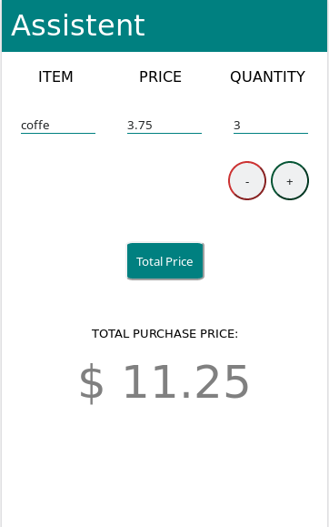

# Assistent

A PWA that helps organize and calculate product prices on purchases.

The technologies used:

* Ruby 2.6.3
* Rails 5.2.3


## Screenshot



## Dependencies

Run this command to install the required gems:

```
$ bundle
```

## Usage

### First step

Command to run the server:

```
$ rails server
```

### Second step

To see the application, open a browser window and navigate to http://localhost:3000.

## LICENSE

This project is licensed under [MIT License](LICENSE).